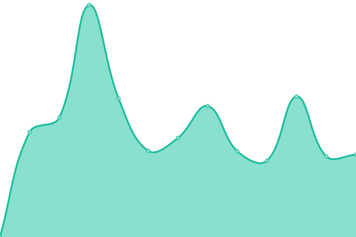
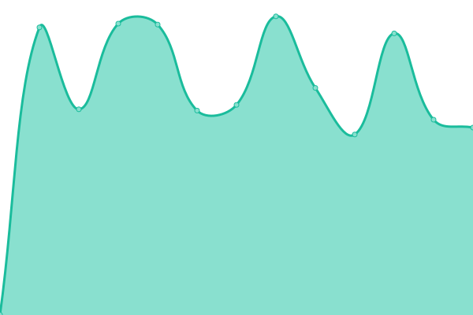

# [📈 Live Status](https://Jim-Paul.github.io/Upptime-Status): <!--live status--> **🟩 All systems operational**

This repository contains the open-source uptime monitor and status page for [Jim-Paul](https://Jim-Paul.github.io/Upptime-Status), powered by [Upptime](https://github.com/upptime/upptime).

With [Upptime](https://upptime.js.org), you can get your own unlimited and free uptime monitor and status page, powered entirely by a GitHub repository. We use [Issues](https://github.com/Jim-Paul/Upptime-Status/issues) as incident reports, [Actions](https://github.com/Jim-Paul/Upptime-Status/actions) as uptime monitors, and [Pages](https://Jim-Paul.github.io/Upptime-Status) for the status page.

<!--start: status pages-->
<!-- This summary is generated by Upptime (https://github.com/upptime/upptime) -->
<!-- Do not edit this manually, your changes will be overwritten -->
<!-- prettier-ignore -->
| URL | Status | History | Response Time | Uptime |
| --- | ------ | ------- | ------------- | ------ |
|  [Jim Paul](https://jimpaul.ng) | 🟩 Up | [jim-paul.yml](https://github.com/Quantumica-ltd/Upptime-Status/commits/HEAD/history/jim-paul.yml) | 

 1112ms
     
 | 

<a href="https://status.quantumica.io/history/jim-paul">95.10%</a>
    

|  [Terrawatt Energy](https://terrawattenergy.io) | 🟩 Up | [terrawatt-energy.yml](https://github.com/Quantumica-ltd/Upptime-Status/commits/HEAD/history/terrawatt-energy.yml) | 

 1165ms
     
 | 

<a href="https://status.quantumica.io/history/terrawatt-energy">94.97%</a>
    

|  [Quantumica](https://quantumica.io) | 🟩 Up | [quantumica.yml](https://github.com/Quantumica-ltd/Upptime-Status/commits/HEAD/history/quantumica.yml) | 

 1087ms
     
 | 

<a href="https://status.quantumica.io/history/quantumica">95.30%</a>
    

<!--end: status pages-->

[**Visit our status website →**](https://Jim-Paul.github.io/Upptime-Status)

## 📄 License

- Powered by: [Upptime](https://github.com/upptime/upptime)
- Code: [MIT](./LICENSE) © [Anand Chowdhary](https://anandchowdhary.com), supported by [Pabio](https://pabio.com)
- Data in the `./history` directory: [Open Database License](https://opendatacommons.org/licenses/odbl/1-0/)
